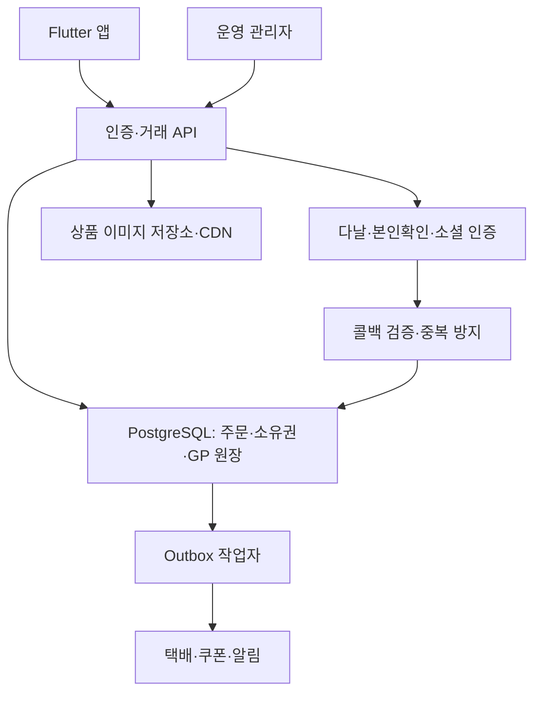
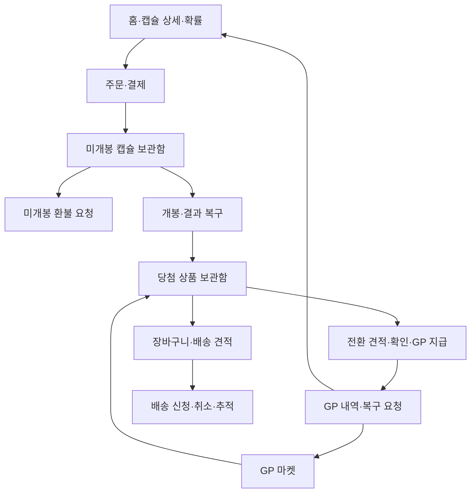

# 가치가차 출시 설계 및 실행 가이드

작성 기준: 2026-09-14 / 저장소 기준 커밋: `73d1157`.
입력: 첨부 서비스 정책 Markdown, Flutter 소스, `app-release (2).aab`, 티프 Google Play 소개.

**판정: 현재는 출시 불가.** 이 문서의 제안 구조는 목표 설계이며 서버 구현 완료를 뜻하지 않는다. 이번 변경은 출시 준비 1차 수정이다. 저장소에는 Flutter 앱만 있고, 주석에서 언급하는 NestJS 백엔드·DB 마이그레이션·관리자 콘솔은 포함되어 있지 않다. 서버가 별도로 존재하지 않는다는 뜻은 아니다.

## 1. 서비스 방향

가치가차의 첫 출시는 **구매한 캡슐과 당첨 상품의 소유권을 확실하게 보장하고, 확률과 전환 가치를 이해하기 쉽게 보여주는 실물 상품 서비스**로 만든다.

티프의 공식 소개에서 참고할 흐름은 상품 수집 → 컬렉션 보관 → 실물 수령, 그리고 참여형 프로모션이다. 거래·교환·경매·사용자 제작 가챠까지 첫 출시 범위에 넣으면 거래·정산·분쟁 모델이 크게 늘어난다. 가치가차 1차 범위는 제공 정책의 직접 구매, 보관, 개봉, GP 전환, 마켓, 배송과 운영 기능으로 정한다. 디자인·브랜드·이미지는 자체 자산을 사용한다.

- 구매 전: 가격, 구성 상품, 확률 적용 기준, 남은 수량, 전환 GP, 환불 조건을 한 화면에서 이해하게 한다.
- 구매 후: 결제 완료와 캡슐 지급 상태를 구분하고, 통신이 끊겨도 내 주문에서 확인하게 한다.
- 개봉 후: 소비자가와 실제 전환 GP를 별도 표시한다. 일반 10%와 프리미엄 100%를 혼동시키지 않는다.
- 운영: 확률·가격·전환율 변경의 승인과 기록, 공급처 품절 대응, 미처리 배송·환불을 관리자에서 처리한다.
- 성장: 첫 구매율·7일 재방문·배송 완료율·분쟁률을 함께 본다. 객단가만 올리기 위해 허위 당첨 피드나 손실 만회 메시지를 사용하지 않는다.

참고: [티프 공식 Play 소개](https://play.google.com/store/apps/details?id=kr.tif.app&hl=ko). 실제 앱 로그인·결제·배송 경험을 검증한 경쟁사 분석은 아니다.

## 2. 정책 반영과 미결정 사항

| 항목 | 제공 정책 | 구현 원칙 / 확정이 필요한 사항 |
| --- | --- | --- |
| 브랜드 | 가치가차 | 상표 사용 가능 여부는 이 코드 검토에서 확인하지 않음 |
| 가입 | 다양한 간편 로그인, 연령 기준 협의 | 실제 OAuth 토큰/코드 검증 필요. 가입·결제·개봉 각각의 연령 기준 확정 전 공개 가입 출시 금지 |
| 닉네임 | 중복 금지, 비속어 금지, 30일마다 변경 | 서버 정규화와 유일성 제약; 변경 시각 기준 서버 검증 |
| GP | 보상·전환형, 충전 불가, 현금 환불 불가, 무기한 | 단일 표시 잔액 + 출처별 원장/소비 배분. 유료 GP 상품 없음 |
| 직접 구매 | 다날, 결제 후 미개봉 보관 | 결제 승인 검증과 캡슐 지급을 서버에서 일관되게 처리 |
| 환불 | 미개봉 구매 후 7영업일, 이벤트 제외 | 제공자의 초안. 청약철회·하자 권리와 문구를 검토 후 확정; 앱이 법정 권리를 일괄 배제하지 않도록 설계 |
| 일반 상품 | 10% 전환, 배송 가능 | 일반/프리미엄 기준은 별도 필드. 등급 이름만으로 전환율 추정 금지 |
| 프리미엄 | 100% 전환, 배송 가능 | 획득 당시 소비자가·전환율·정책 버전 스냅샷 저장 |
| 전환 복구 | 등급·기간·횟수별, 포인트 사용 시 불가 | 해당 전환에서 나온 GP 소비 여부 추적 필요. 잔액이 충분하다는 이유만으로 복구 허용 금지 |
| 상품 잠금 | 포인트 전환 제한 | 잠금만으로 배송을 막지 않음. 장바구니와 잠금은 별도 상태 |
| 배송 | 장바구니 → 신청; 준비중까지만 취소, 주소 변경 불가 | 기본/도서산간 요금, 묶음배송, 무료 기준은 미정. 3,000원 고정은 확정 정책 아님 |
| 확률 | 등급형/무등급형, 관리자 수정, 유한 이벤트 | 고정확률형과 재고 소진형의 별도 모드 필요. 숨은 정규화 금지 |
| 보장 | 특정 구간 보장 | 사전 공개 규칙·적용 카운터·재고 보장·버전 필요. 개별 사용자 당첨 임의 조작 기능으로 만들지 않음 |
| MAX | 박스 총 개수 | 구매 가능 수량은 남은 판매 재고, 개봉 가능 수량은 보유 미개봉 수량. 서버 한도와 구분 표시 |
| 결과 공개 | 애니메이션 종료/스킵 | 확정·저장은 서버 트랜잭션 시점; 화면 공개만 연출 이후 |
| 상품 가격 | 외부 판매처 소비자가 참조 | 출처 URL·확인일·증빙·가격 변경 이력 저장. 공급가와 별도 관리 |
| 보관·탈퇴 | 무기한 보관, 법정 기록 보관 | 탈퇴 시 잔여 주문·배송·재화 처리 기준 필요. 이용자 화면 삭제와 의무 보관 DB 분리 |

실물·디지털·상품권 혼합 및 랜덤 획득 구조의 스토어 취급을 PG 선택만으로 확정할 수 없다. [Google Play 결제 정책](https://support.google.com/googleplay/android-developer/answer/9858738?hl=ko)은 디지털 구매와 실물 구매를 구분한다. [Apple 심사 지침](https://developer.apple.com/app-store/review/guidelines/)도 실제 서비스 구조에 따라 검토한다. 티프의 표시 연령을 가치가차에 그대로 적용할 수 없다. 사업자·법률 검토와 스토어/PG 심사 확인을 출시 게이트로 둔다.

## 3. 현재 코드 진단

| 영역 | 현재 확인 사실 | 이번 반영 | 남은 출시 작업 |
| --- | --- | --- | --- |
| 앱 구조 | Flutter + Provider + REST, 네이티브 프로젝트 존재 | 기존 구조 유지 | 실제 기기 QA, 접근성·성능 |
| 인증 | 기기 생성 providerId를 소셜 인증처럼 전송 | 모의 소셜 경로 삭제, 이메일 유지 | OAuth, 서버 검증, 본인확인, 연령·약관, 탈퇴 |
| 토큰 | shared_preferences 평문 저장 | 보안 저장소로 변경; 기존 평문 토큰 제거 후 재로그인 | 기기별 Keychain/Keystore·로그아웃·복구 검증, 서버 토큰 회전 |
| API | 임시 URL 하드코딩, 제한시간 없음 | HTTPS 환경 설정, 20초 제한, 오류 정규화, 자동 재전송 없음 | 운영 서버, 공통 오류 코드와 세션 만료 통합 |
| GP | `/wallet/topup` 데모 충전 | 충전·87% 로컬 환원 삭제·차단, GP 정보/내역 화면 | 원장·전환·복구 서버 구현 |
| 캡슐 | 구매 즉시 `/draws` 호출 | 기존 거래는 출시 빌드 차단, 판매 잔여 수량 기반 MAX | 주문→지급→미개봉 보관→개봉 분리 |
| 개봉 연출 | 서버 오류 때 대기 지속, 프리뷰 종료 때 재추첨, 결과 화면 로컬 GP 가감 | 오류 종료, 프리뷰 조작·재추첨/로컬 GP 가감 제거, 소비자가 기준 강조 | 중단 복구 API, 멱등 요청, 서버 상품 메타데이터 확인 |
| 상품 보관함 | 목록/필터/정렬 있음 | 알 수 없는 상태 보수 처리, 배송 상태 확인, 잠금 배송 허용 | 잠금 API·전환·복구·장바구니·페이지네이션 |
| 배송 | 고정 3,000 GP; 배송 요청 API 호출 | 출시 거래 차단, 상태·중복선택·전화 검증, 우편번호 전달 보완 | 견적·장바구니·주소 검색·취소·추적·디지털 발송 |
| 내비게이션 | 아이콘만 표시, 의미 불일치 | 실제 탭 명칭과 접근성 라벨 | 사용자 테스트 |
| Android | main manifest에 INTERNET 없음 | 권한·HTTPS·백업 제한 | 서명·버전·대상 SDK·기기 빌드 확인 |
| 테스트 | 데모 흐름을 가정한 위젯 테스트 | API/인증/재고 상태 테스트 및 CI | 통합·부하·실기기·PG 테스트 |
| 관리자/서버 | 이 저장소에 없음 | 목표 모듈과 계약 작성 | 기존 소스 확보 후 구현·검증 |

**차단 설정은 보안 경계가 아니다.** 수정 전 앱 또는 외부 호출자는 기존 서버에 직접 요청할 수 있다. 서버에서도 임의 GP 지급과 providerId만 받는 인증을 폐쇄하고, 거래 요청을 검증해야 한다.

AAB는 Flutter 리소스를 포함한 Android App Bundle이다. 제출 가능한 운영 앱임을 증명하지 않으며 이 Git 커밋에서 빌드됐는지도 미확인이다. 첨부 AAB는 변경하지 않았다.

## 4. 목표 구성도

첫 서버는 NestJS 기반 모듈형 단일 서비스와 PostgreSQL을 우선 제안한다. 이는 앱 주석과의 정합성을 위한 제안이며 기존 서버 스택을 확인한 뒤 결정한다. 초기부터 불필요한 마이크로서비스로 나누지 않는다.

관리자는 상품/엑셀 등록, 캡슐 구성, 확률 버전, 재고·공급처, 주문·환불, 배송·쿠폰, GP 원장 조회, 고객센터, 이벤트, 권한·감사로그를 제공한다. 금융성 변경·확률 배포는 역할을 분리하고 변경 이유와 승인자를 남긴다.

## 5. 데이터와 거래 불변 조건

| 데이터 | 핵심 필드·제약 |
| --- | --- |
| user / identity / consent | 제공자+검증된 subject 유일성, 닉네임 정규화 유일성, 약관 버전·동의 시각 |
| product / supplier_offer | 소비자가, 공급가, 가격 출처·확인일, 품절, 배송 유형, 전환 가능 여부 |
| capsule_type / probability_version | 가격·활성 상태, 확률 모드, 불변 확률 스냅샷, 적용 시점 |
| pool / pool_prize | 이벤트 총 수량, 남은 상품 수량, 구매 예약과 개봉 시 재고 관계 |
| order / payment / refund | 통화·서버 가격, PG 거래 ID 유일성, 승인·환불 상태, 원주문 참조 |
| owned_capsule | 소유자, 원주문, 상태, 환불 가능 기한, 적용 풀·확률 버전 |
| draw / draw_result | 멱등 키·요청 해시, 개봉한 캡슐 ID 유일성, 확률 버전, 상품 소유권 ID |
| inventory_item | 소유자, 원천 거래, 획득 시 소비자가·전환 GP, 처리 상태, 잠금 |
| gp_ledger / allocation | 변경 불가 증감 내역, 원인 거래 유일성, 잔액, 전환 출처별 소비 배분 |
| conversion / restoration | 원전환 참조, 정책 버전, 복구 기한·횟수·소비 여부 |
| cart / shipping_quote / shipment | 소유권, 주소·요금 스냅샷, 견적 만료, 배송 상태, 취소 사유 |
| webhook_event / outbox / audit_log | 외부 이벤트 ID 유일성, 재처리 상태, 비밀정보 제거한 변경 이력 |

1. 돈·재고·상품 소유권·GP를 앱 로컬 상태로 확정하지 않는다. 가격·전환율은 서버가 결정한다.
2. 동일 `(사용자, 작업, 멱등 키)` 재요청은 같은 결과를 반환한다. 같은 키의 다른 본문은 409로 거절한다. 키를 재시도 때 새로 만들지 않는다.
3. 하나의 캡슐은 환불과 개봉 중 하나만 성공한다. DB 잠금/조건부 상태 변경과 유일성 제약으로 보장한다.
4. 개봉은 캡슐 소비·재고 차감·결과·상품 지급이 모두 성공하거나 모두 롤백돼야 한다. 서버 CSPRNG를 사용한다.
5. 결제 콜백은 서명/서버 조회로 진위를 확인하고 주문 ID·통화·금액을 대조한다. 앱의 성공 화면을 결제 증거로 쓰지 않는다.
6. PG 승인 이후 DB 실패는 대사 작업으로 지급 또는 환불 처리한다. 외부 PG 호출과 DB가 한 트랜잭션인 것처럼 가정하지 않는다.
7. 배송·전환은 같은 상품을 동시에 소비하지 못한다. 요청 전체 원자 처리 또는 명시적인 항목별 실패 계약을 사용한다.
8. GP 복구는 해당 전환 GP가 일부라도 소비되면 불가하다. 다른 보상 GP를 새로 받아 잔액을 채워도 복구 조건은 바뀌지 않는다.
9. 알림·쿠폰 발송은 DB 확정 후 Outbox로 수행한다. 장애 재시도로 쿠폰이 중복 발송되지 않아야 한다.
10. 금액은 원/GP 단위 정수로 저장한다. 확률은 정수 스케일 또는 유리수로 검증하고 표시 반올림과 실제 추첨값을 분리한다.

### 확률 모드

- **고정확률형:** 배포 전 전체 합계가 정확히 100%인지 검증. 등급 내 상품 선택 규칙까지 공개·버전화. 품절을 이유로 조용히 다른 상품의 확률을 올리지 않는다. 판매 중지·새 버전·명시적 대체 정책 중 확정안을 적용한다.
- **유한 재고형:** 잔여 수량 기반 확률인지 최초 구성 확률인지 명확히 표시. 구매 예약 수량과 미개봉 캡슐을 포함해 총 지급 가능 수량 보장. 구매 시 적용 버전은 고정하고, 개봉 시 남은 풀에서 추첨할지 사전 배정할지 결정해야 한다.
- **보장형:** 공개 구간·대상·리셋 조건·동시 개봉 처리와 별도 보장 재고를 사전 확정. 운영자가 결과를 보고 특정 사용자에게 소급 적용하지 못하게 한다.

## 6. 단계별 진행과 완료 조건

기간은 서버 소스·인력·외부 계약 상태 확인 전 약속하지 않는다. 아래 각 단계의 검증을 통과한 뒤 다음 단계로 진행한다.

| 단계 | 작업 묶음 | 통과 기준 |
| --- | --- | --- |
| 0: 정책·현재 상태 고정 | 연령, 환불, 배송비, 확률 모드, 일반/프리미엄 분류, 소스·환경 목록 | 정책 결정 기록과 개발·검증·운영 환경 분리 |
| 1: 기반 정리 | 이번 수정, 서버 인증·권한, 비밀 관리, 에러/관측, CI | 정적 분석·테스트, 허위 인증·임의 잔액 지급 불가 |
| 2: 주문과 캡슐 | 다날 테스트 결제, 영수증, 지급, 미개봉 보관, 취소·환불·대사 | 중복 콜백·금액 위조·승인 후 장애·부분 환불 시 지급/환불 일치 |
| 3: 개봉과 소유권 | 확률 버전, 재고, 멱등 개봉, 결과 재조회, 연출 | 동시 요청에도 초과 당첨/중복 소비 없음; 앱 종료 후 동일 결과 복구 |
| 4: GP·마켓·배송 | 전환 견적/확인, 복구, 잠금, 장바구니, 배송 견적/취소, 마켓 | GP 음수/중복 지급 없음; 잠금 상품 전환 차단; 배송·전환 동시 성공 불가 |
| 5: 운영 완성 | 엑셀 검증·미리보기·일괄 반영, 문의/첨부, 품절, 알림, 감사 | 운영자가 DB 직접 수정 없이 일상 업무와 실패 복구 수행 |
| 6: 출시 후보 | 실제 Android/iOS 기기, 심사 자료, 개인정보·탈퇴, 접근성, 성능, 관측 | 테스트 증거, 서명 빌드·버전, 운영 대사, 복구 훈련, 정책/PG 확인 |
| 7: 제한 출시 | 소규모 사용자, 단계적 확대, 운영자 상시 대응 | 주문/GP/재고 대사 차이 0; 금액·소유권 오류 0; 목표 지표 측정 후 확대 |

첫 출시 UI 권장 구조는 홈 / 보관함 / 마켓 / GP / 마이. 랭킹·이벤트는 홈 진입점으로 확장하는 방향을 제안한다. 이번 코드는 기존 탭 위치를 유지해 홈/랭킹/보관함/GP/마이로 명확히 표기했다. 마켓 API/화면 구현 시 최종 탭 구성을 적용한다.

## 7. 출시 검증 시나리오

- 동일 결제 콜백 100번 → 결제 1건, 캡슐 지급 1회.
- 서로 다른 사용자 100명이 마지막 재고 1개 요청 → 허용 수량을 초과한 판매/당첨 없음.
- 같은 캡슐의 환불·개봉 동시 요청 → 하나만 확정.
- 개봉 서버 저장 직후 앱 종료 → 재접속 시 같은 결과; 추가 차감 없음.
- 전환 버튼 연타/다른 기기 요청 → 한 번만 GP 지급.
- 전환 GP 일부 사용 후 복구 → 거절; 미사용·기한·횟수 충족 → 원전환 정확히 되돌림.
- 배송 신청과 GP 전환 동시 요청 → 하나만 확정; 요청 중 소유권 변경 → 서버 거절.
- 배송 준비중 취소 → 상품 상태 복원 및 실제 차감액만 복구. 집화 후 취소 → 거절.
- 다른 사용자 주문/보관함 ID, 관리자 API 일반 사용자 호출 → 거절.
- 만료 견적·조작 가격·음수 수량·과도한 수량·만료 인증·재전송된 OAuth 코드 → 거절.
- 오프라인·서버 503은 빈 내역/0원 성공으로 표시하지 않음.
- TalkBack/VoiceOver, 큰 글씨, 작은 기기, 키보드, 스킵·뒤로가기·앱 복귀 검증.
- 운영 환경에서 합성 거래/PG 테스트 거래가 실제 고객 지표와 섞이지 않음.

제안 운영 지표: 승인→지급 지연, 처리 불명 주문 수, 원장 대사 차이, 재고 불일치, 배송 SLA 초과, 앱 비정상 종료율. 승인 후 미지급·중복 차감·권한 침해는 즉시 구매 중단과 담당자 알림 대상으로 둔다. 숫자 기반 지연·부하 목표는 예상 트래픽을 정한 뒤 확정한다.

## 8. 운영·출시 준비물

- 기존 백엔드·관리자 저장소와 API 명세, DB 스키마/마이그레이션, 배포 구조.
- 다날 테스트/운영 가맹점, 승인·취소·조회 계약, 콜백 주소, 테스트 계정.
- Google/Kakao/Naver/Apple 앱 등록과 리디렉션 설정; 비밀값은 채팅/앱 코드에 넣지 않고 서버 비밀 저장소로 전달.
- 본인확인 계약과 연령 기준, 사업자/통신판매 정보, 약관·개인정보·환불 문구.
- 공급처/배송사/쿠폰 발송 계약, 상품 데이터·이미지 사용 권한, 배송 요금표.
- Play/App Store 계정, 기존 등록 여부·최고 versionCode, 서명 업로드 키와 인증서 지문.
- 대사·백업/복원·장애 연락·권한 회수·고객 문의 대응 책임자.

**다음 개발의 가장 큰 의존성은 백엔드와 관리자 소스다.** 확보되면 기존 DB와 API를 먼저 대조한 다음, 아래 계약을 버전 API로 구현하고 Flutter의 기존 즉시 개봉 경로를 교체한다.
